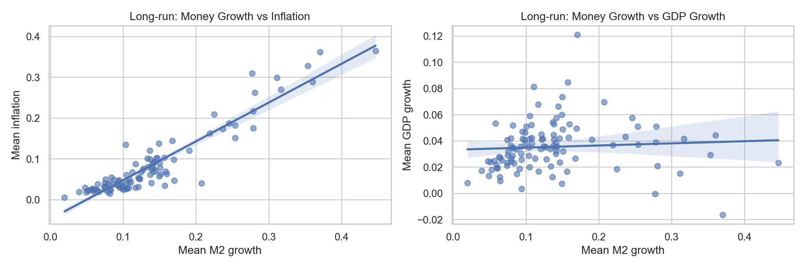
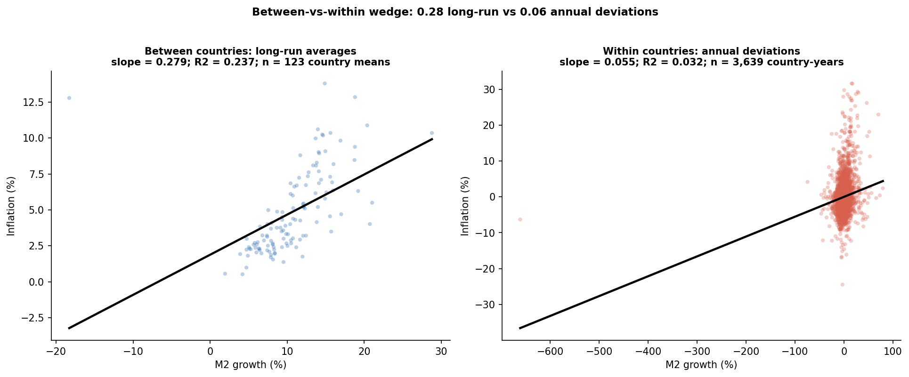
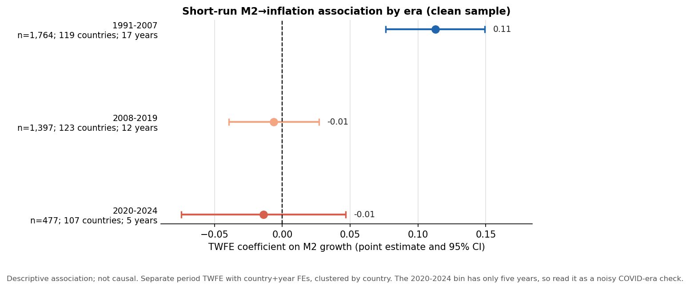
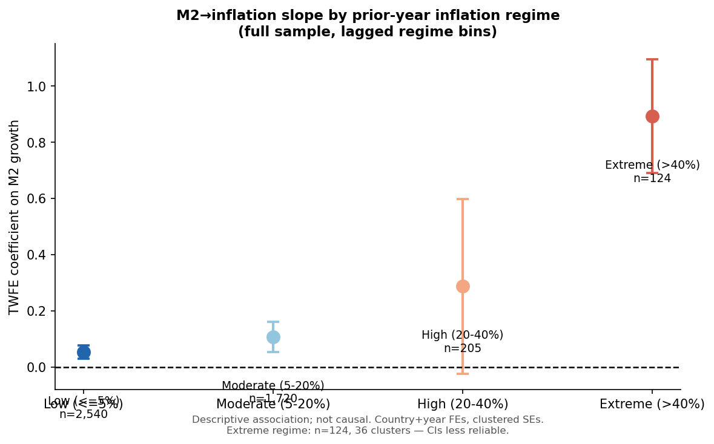
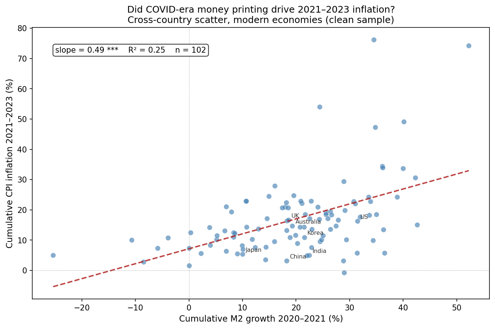
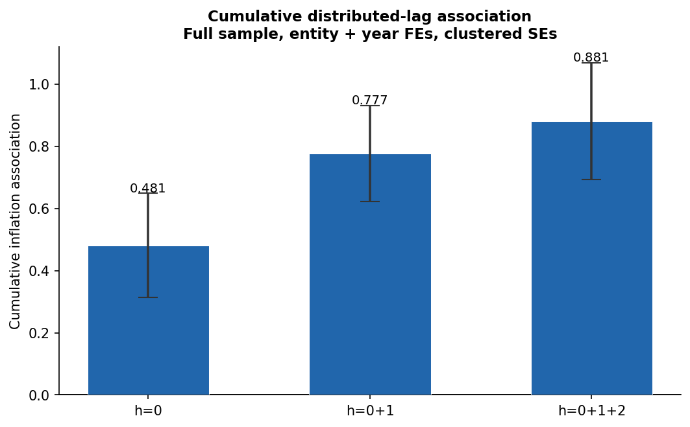

# Money Growth and Inflation: Replication and Revisit of the Lucas idea

**With a 160-country annual macro panel, 1991-2024.**

*Long-run quantity-theory evidence survives; short-run within-country pass-through weakens after 2008.*

> **Note:** This is a descriptive study, not causal research.
---

## 1. Long-Run Lucas Benchmark

Replicating the Lucas (1996) / McCandless-Weber (1995) style long-run comparison, countries with higher average money growth have higher average inflation.
The same long-run relationship does not appear for real GDP growth.

## 2. The Core Contrast: Between vs. Within

Over a 30-year time-frame, countries with higher average money growth have faster average inflation (**Long-run**).
However, year-to-year deviations in money growth barely predict same-year inflation deviations in modern samples (**Short-run**).

## 3. The Short-Run Collapse Post-2008

The annual within-country association was clearly visible before 2008, but drops to near-zero in the post-QE era.

---

## Exploratory Appendices

### High-inflation episodes drive the full-sample short-run slope

The descriptive M2-Inflation slope rises sharply with the inflation regime — near zero in stable economies, close to one in extreme-inflation environments.
This nonlinearity explains most of the gap between the full-sample (0.855) and clean-sample (0.096) short-run estimates.

### COVID Stress Evidence (Short-run association)

During the 2020-2023 COVID episode, cross-country money growth and inflation moved together descriptively. Countries with higher broad-money growth also tended to experience higher inflation.

### Multi-Year Pass-Through (Distributed Lag)

Pass-through isn't just same-year — the association builds from ~0.5 at one year to ~0.9 over three years, reconciling the weak annual slope with the strong long-run pattern.
The effect arrives later rather than never.

### Inflation Targeting: Drop in Slope

Countries that adopted Inflation Targeting saw a lower within-country M2-to-Inflation slope post-adoption.

Within-country slopes rise from 0.053 in low-inflation environments to 0.893 at extreme inflation: describing different regimes.

### The U.S. Perspective: Two Eras

Applying the classic Lucas (1980) filter to U.S. M2 shows the same story: a strong historical relationship that severely flattens post-2008.
M1 definition changed in 2020 and thus pivot to M2.

---

## Main Numeric Results

| Object| Coefficient | Interpretation |
|---|---:|---|
| **Long-run cross-country** (Full) | **0.952** | Near one-for-one over 30 years |
| **Long-run cross-country** (Clean) | **0.524** | Strong and positive even without hyperinflation |
| **Short-run within-country** (Full) | **0.855** | Driven heavily by extreme-inflation years |
| **Short-run within-country** (Winsorized 1/99) | **0.422** | Mitigates hyperinflation outliers |
| **Short-run within-country** (Clean)| **0.096** | Weakened annual pass-through |

> The gap between the full (0.952) and clean (0.524) long-run slopes reflects genuine regime nonlinearity.

---

## Document and Files

- **Memo/Write-up:** `money_inflation_write_up.pdf` key findings write-up on pages 1-3, related graphs and tables in the appendix.

- **Core Panel:** `02_data/analysis_ready/macro_growth_merged.csv` Data are downloaded from World Bank, World Development Indicators (WDI).

- **Data Source:** `02_data/DATA_Source.md` describes the details of data and variables used.

- **Codebase:** All analyses are within `03_analysis_notebooks/`.

- **Graphs and Tables:** All graphs and tables are within `04_current_results/`.

---

## Reference & Credit

- The empirical design and findings are consistent with recent regime-dependence arguments by Borio et al. (2024) and the IT-anchoring dynamics noted by Teles et al. (2016).

- Sargent & Surico (2011) mentioned that Lucas-style unit slope is unstable and disappeared in the U.S. after 1984 (the Great Moderation).

- Borio et al. (2024) argues that the link has become "virtually non-existent" in low-inflation environments.

---