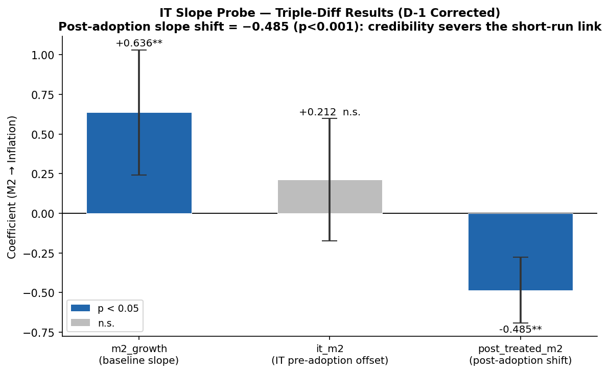
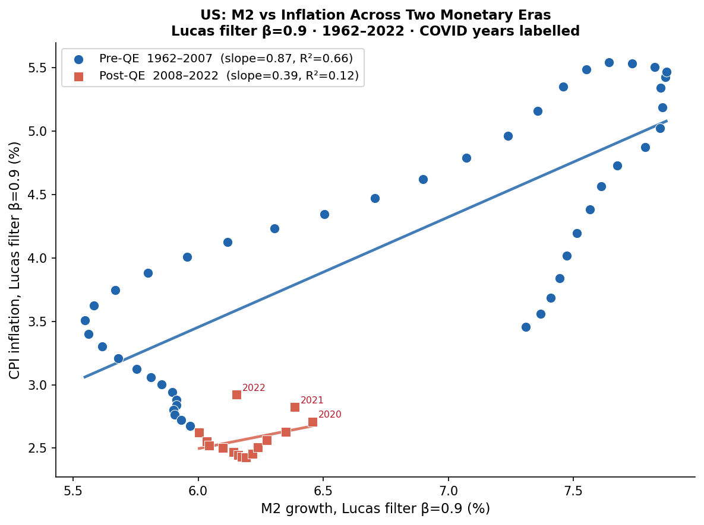

# Money Growth and Inflation After QE and COVID

**160-country annual macro panel, 1991-2024.**

*Long-run quantity-theory evidence survives; short-run within-country pass-through weakens after 2008.*

> **Note:** This is a descriptive empirical audit, not a causal policy paper.

---

## 1. The Core Contrast: Between vs. Within
Countries with persistently faster money growth have faster average inflation (**Between**). However, year-to-year deviations in money growth barely predict same-year inflation deviations in modern clean samples (**Within**).


## 2. The Short-Run Collapse Post-2008
The annual within-country association was clearly visible before 2008, but drops to near-zero in the post-QE era.


## 3. Prior Inflation Regime Matters
The descriptive slope is much larger in environments where prior-year inflation was already high, mirroring the "clean vs. full" sample split.


## 4. COVID Stress Evidence
During the 2020-2023 COVID episode, cross-country money growth and inflation moved together descriptively.


---

## Exploratory Appendices

### Multi-Year Pass-Through (Distributed Lag)
Pass-through isn't just same-year. The association accumulates over multiple years, eventually approaching the long-run cross-country slope.


### Inflation Targeting Explores The Drop
Countries that adopted Inflation Targeting saw a sharp drop in their within-country M2→Inflation slope post-adoption.



### The U.S. Perspective: Two Eras
Applying the classic Lucas (1980) filter to U.S. M2 shows the same story: a strong historical relationship that severely flattens post-2008.



---

## Main Numeric Results

| Question | Coefficient | Interpretation |
|---|---:|---|
| **Long-run cross-country** (Full) | **0.952** | Near one-for-one over 30 years |
| **Long-run cross-country** (Clean) | **0.524** | Strong and positive even without hyperinflation |
| **Short-run within-country** (Full) | **0.855** | Driven heavily by extreme-inflation years |
| **Short-run within-country** (Clean)| **0.096** | Weakened annual pass-through |

---

## Data & Reproducibility

- **Core Panel:** `02_data/analysis_ready/macro_growth_merged.csv` (160 countries, 4,750 rows).
- **Codebase:** All analyses are fully contained and executable within `03_analysis_notebooks/`.
- **Final Memo:** [`money_inflation_audit_report.pdf`](money_inflation_audit_report.pdf) from [`money_inflation_audit_report.tex`](money_inflation_audit_report.tex).

Environment:

```bash
python -m venv .venv
source .venv/bin/activate
pip install -r requirements.txt
```

Notebook execution order:

```bash
jupyter nbconvert --to notebook --execute --inplace 03_analysis_notebooks/01_lucas96_mcweber_replication.ipynb
jupyter nbconvert --to notebook --execute --inplace 03_analysis_notebooks/02_money_inflation_twfe.ipynb
jupyter nbconvert --to notebook --execute --inplace 03_analysis_notebooks/02b_money_inflation_exploratory.ipynb
jupyter nbconvert --to notebook --execute --inplace 03_analysis_notebooks/03_short_run_lp_iv.ipynb
jupyter nbconvert --to notebook --execute --inplace 03_analysis_notebooks/04_did_it_event_study.ipynb
jupyter nbconvert --to notebook --execute --inplace 03_analysis_notebooks/05_lucas_us_appendix.ipynb
```

Data snapshots are checked into `02_data/`; regenerated figures and tables write to `04_current_results/`.
