# Money Growth, Inflation, and GDP Growth

## Start Here

- `START_HERE.md`

Question:

> Across countries, how strongly is money growth linked to inflation and GDP growth?

## Run

```bash
python3 -m pip install -r requirements.txt
# Notebook-first flow
# 1) notebooks/phase_0_objA_lucas_replication.ipynb (Run All)
# 2) notebooks/phase_1_objB_baseline.ipynb (Run All)
# 3) notebooks/phase_2_objB_short_run.ipynb (Run All)

# Optional script parity check
python3 v2/run_v2_rebuild.py
python3 v2/build_portfolio_graphs.py
```

## What to show

- `v2/outputs/V2_SUMMARY.md`
- `v2/outputs/portfolio_graphs/`

## Headline

- Inflation: strong positive association with money growth.
- GDP growth: weak and non-robust association.
- Evidence is associational, not final causal identification.

## Workflow Note

- Current cycle is notebook-first (`notebooks/phase_0*`, `phase_1*`, `phase_2*`) with script parity checks in `v2/`.
- Legacy `outputs/phase*` artifacts are historical references only.

## Repository Layout

- Root keeps active run inputs (`macro_growth_merged.csv`, `m2_raw.csv`, `cpi_raw.csv`, `gdp_raw.csv`) and canonical docs.
- `notebooks/` contains the 3-phase notebook story for Obj A and Obj B.
- `v2/` contains script parity checks and portfolio graph generation.
- `docs/legacy_notes/` stores older narrative notes kept for reference.
- `archive/legacy_data/`, `archive/legacy_reports/`, `archive/references/`, and `archive/notebooks_legacy/` store historical materials moved out of root.
- See `docs/REPO_LAYOUT.md` for the full post-cleanup map.

## Graphs

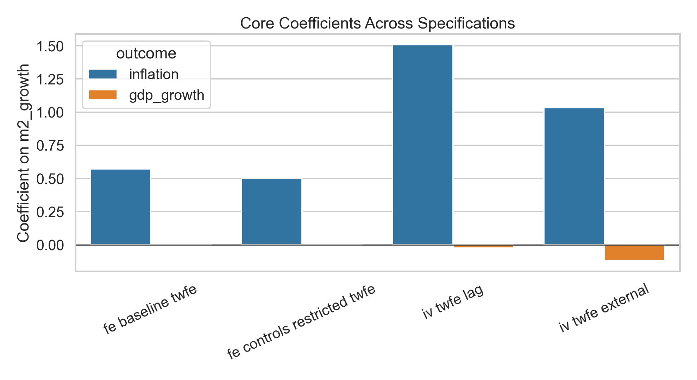
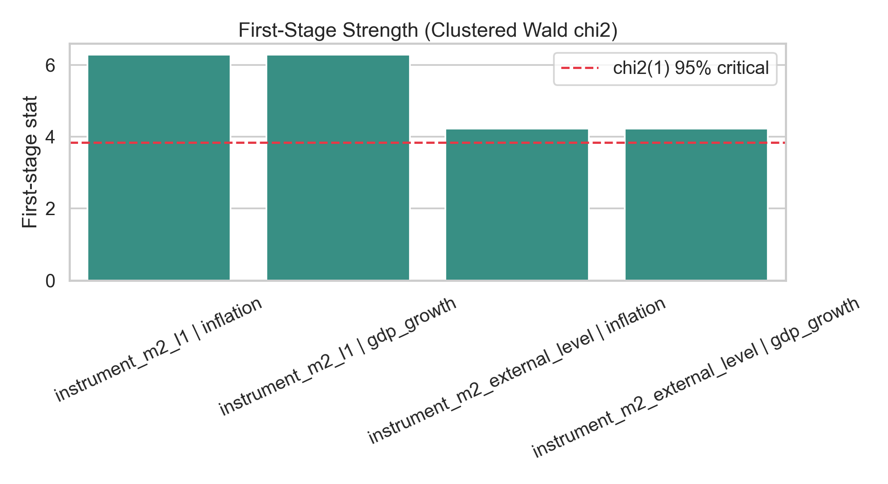
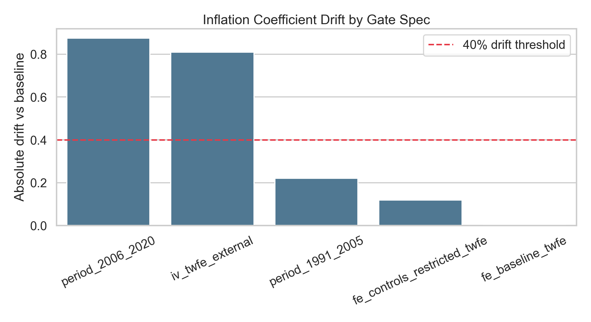
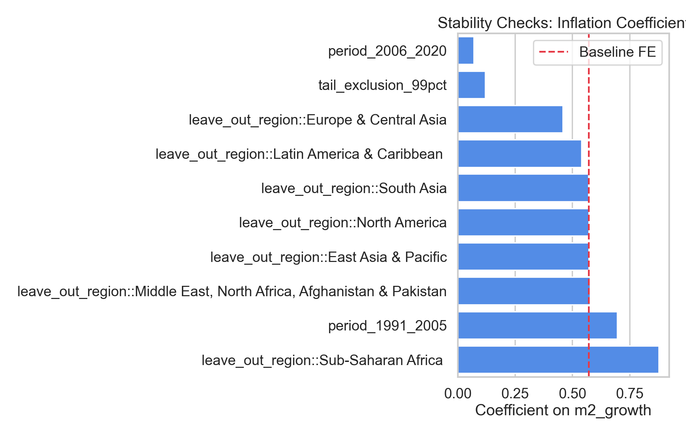
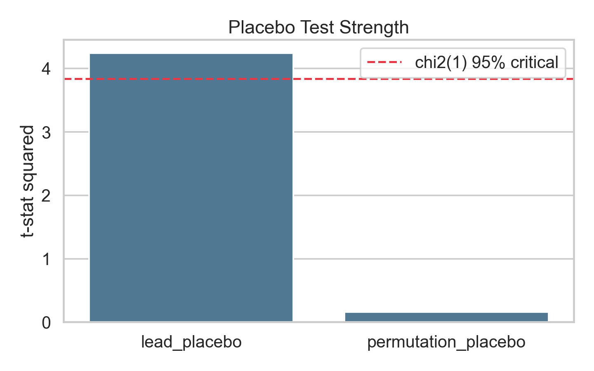
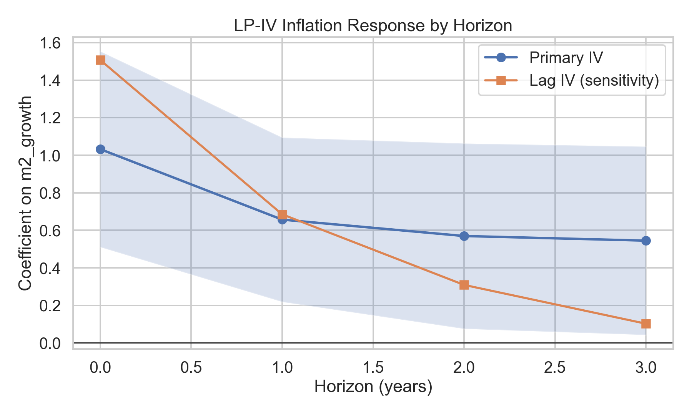
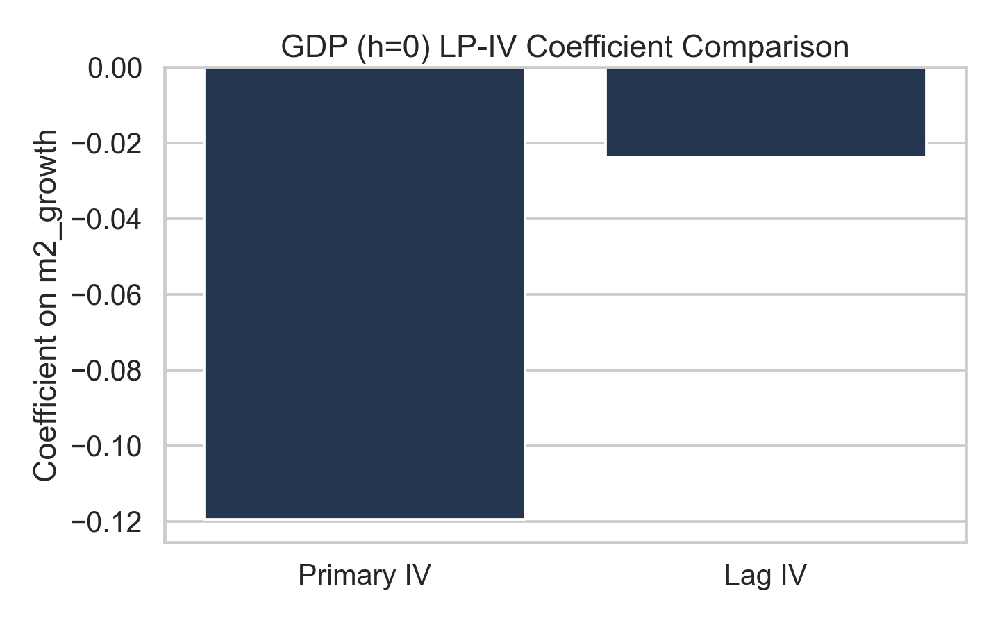
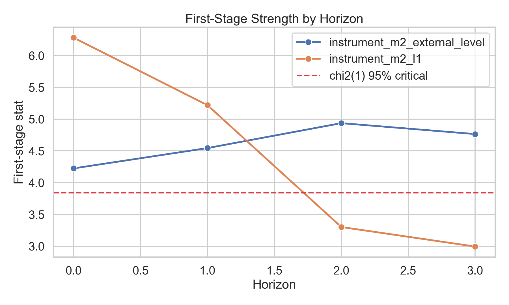
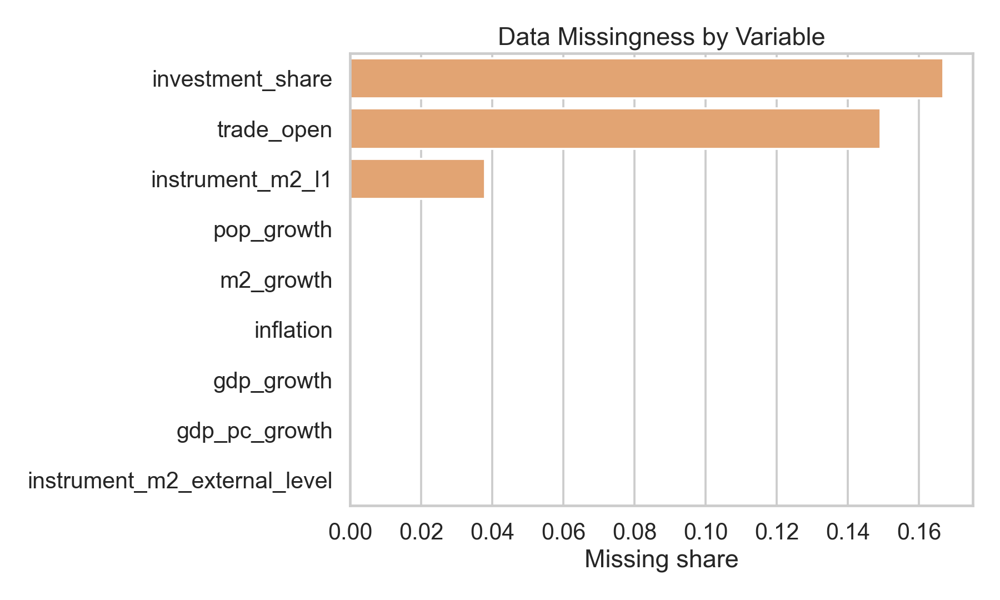
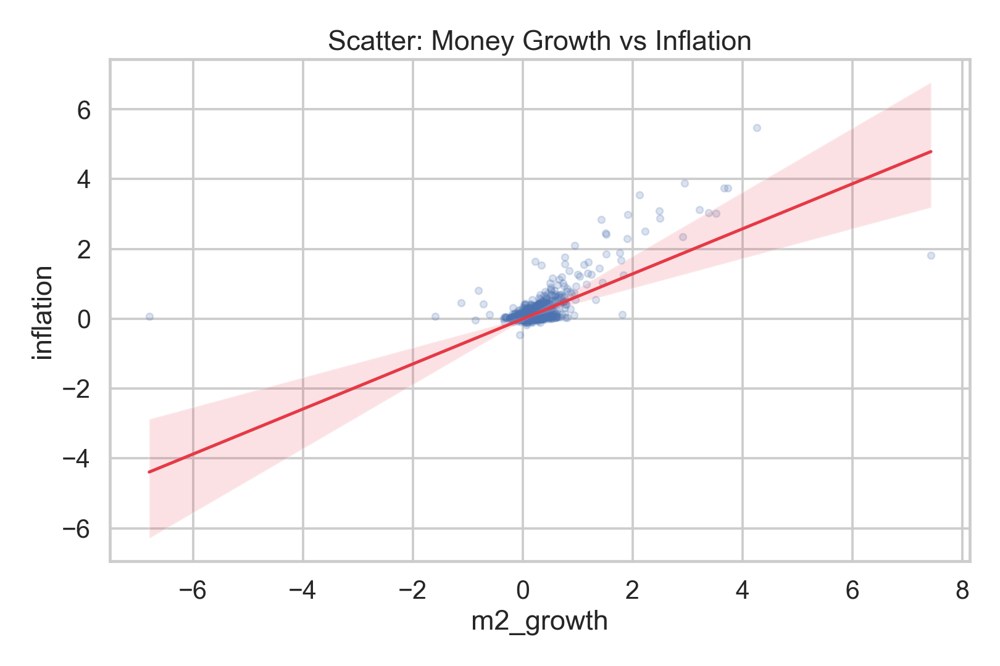
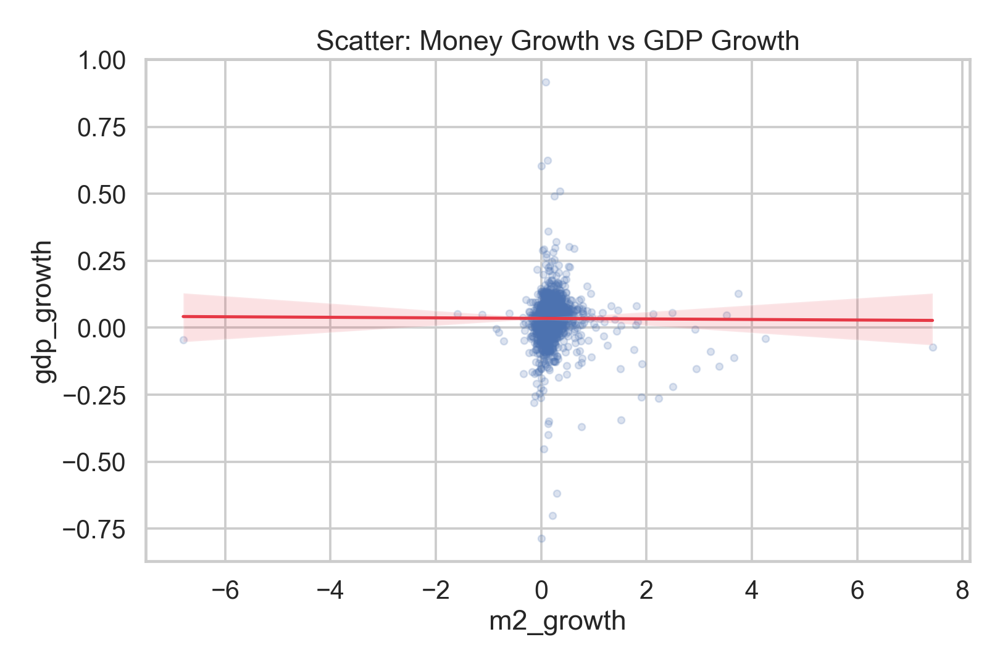
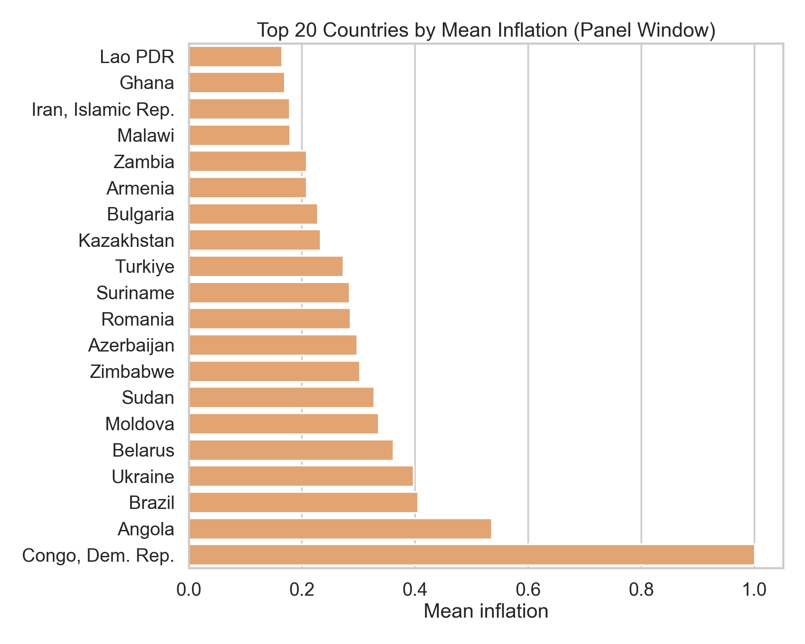
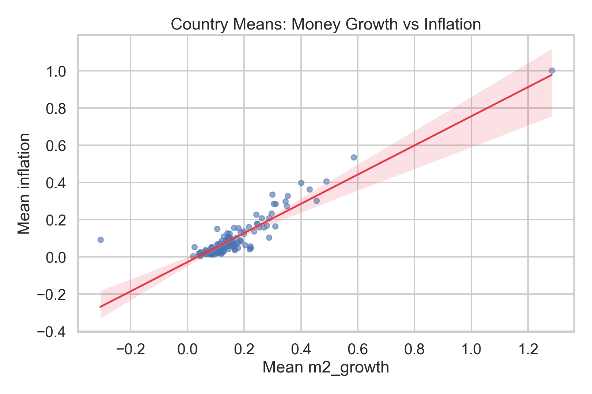
